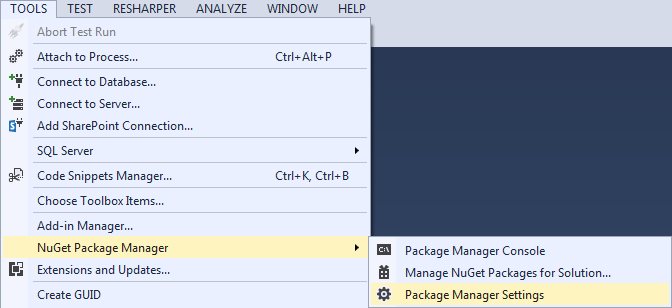
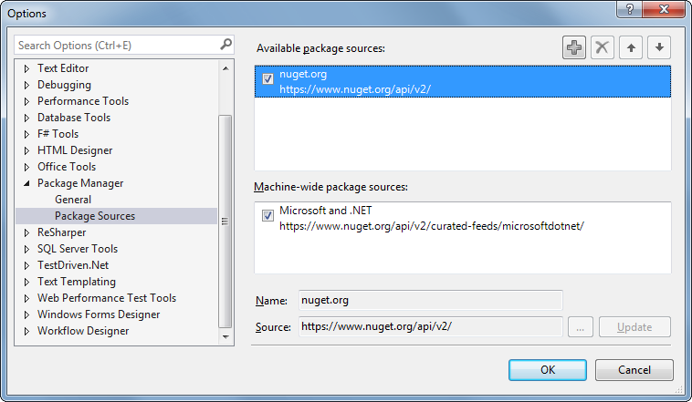
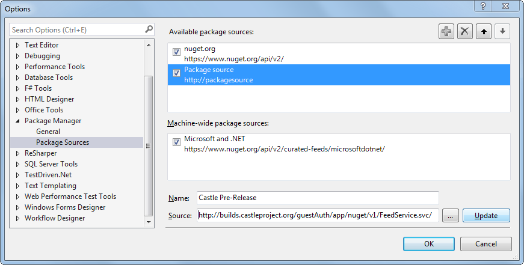
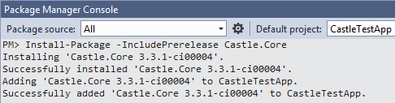

# Getting Pre-Release Castle Packages

Released versions of the various Castle projects are published to public feeds on [NuGet](http://www.nuget.org) (the recommended way to consume Castle projects) or can be downloaded directly from the GitHub Releases pages for [Castle Core](https://github.com/castleproject/Core/releases) and [Castle Windsor](https://github.com/castleproject/Windsor/releases). However, sometimes clients may need functionality or bug fixes that have been built, but are not yet released, so the Castle Project provides access to pre-release builds as they are produced by the continuous integration server.

## The Pre-Release NuGet Feed

The Castle Project continuous integration server publishes a feed of just-built packages at:
`http://builds.castleproject.org/guestAuth/app/nuget/v1/FeedService.svc/`

## Adding the Feed

The pre-release feed must be added to the Package Manager configuration to be used. To this, in Visual Studio, open **Tools** → **NuGet Package Manager** → **Package Manager Settings**.

Then select **Package Manager** → **Package Sources** and click on the "plus" (**+**) button near the top.

Fill in the **Source** URL as above and a **Name** of your choice, and click **Update**, followed by **OK**.

## Getting the Pre-Release Packages

Now pre-release packages can be added to projects from within Visual Studio. Open the Package Manager Console (**Tools** → **NuGet Package Manager** → **Package Manager Console**), ensure that **All** is selected in the **Package Sources** dropdown, and type:

`Install-Package -IncludePrerelease Castle.Core`

(Or similarly for other packages.) The **-IncludePrerelease** flag ensures that the pre-release versions will be considered. Otherwise, only released packages will be installed.

